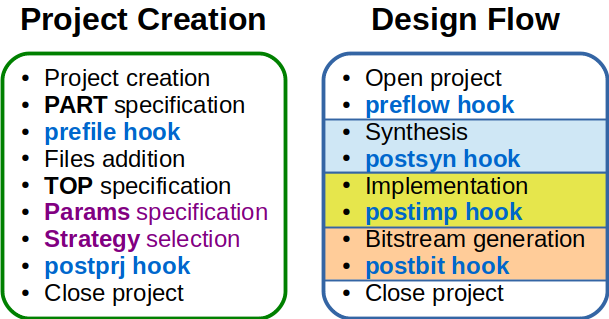

# PyFPGA User Guide

You can read the detailed [API reference](api-reference.md) and/or start with
the [Examples](../examples). In this document, you will find a tutorial about
basic and advanced uses of PyFPGA.

* [System Setup](#system-setup)
* [Basic usage](#basic-usage)
* [Advanced usage](#advanced-usage)
* [Transfer to a device](#transfer-to-a-device)
* [Logging capabilities](#logging-capabilities)

## System setup

## Basic usage

First step is to import and instantiate the `Project` *class*:

```py
from fpga.project import Project

prj = Project('vivado', 'ProjectName')
```

Where the first parameter is one of the supported Tools (`ise`, `libero`,
`quartus`, `vivado`) and the second one is the name of the project.

The default output directory, where files will be generated, is created in the
same directory that the running script and is called `build`.
You can optionally change it with:

```py
prj.set_outdir('NewOutputDir')
```

You can use the default FPGA part for a quick test, but generally, you will
want to specify a particular one:

```py
prj.set_part('FPGApart')
```

> Examples:
> * Ise: `xc7k160t-3-fbg484`
> * Libero: `mpf100t-1-fcg484`
> * Quartus: `10cl120zf780i8g`
> * Vivado: `xc7k160t-3-fbg484`

Next step is to specify the project files (HDLs, Constraints, TCLs) and the
top-level name.

```py
# First, we recommend Verilog Header Files (if used)
prj.add_files('headers/project.vh')
# Then HDL Components/Modules
prj.add_files('vhdl/*.vhdl', 'OptionalLibraryName')
prj.add_files('verilog/*.v')
# And finally constraints
prj.add_files('project.sdc')
...
prj.set_top('TopName')
```

> **NOTEs:**
> * For some Tools, the order could be a problem. If a complain about
> something not Found is displayed, try to change the order.
> * For some Tools, the file extension could be a problem. If a file
> seems unsupported, you can always use project options
> (see [Advanced usage](#advanced-usage)).
> * A file with the tcl extension will be included with the `source`
> command. It could be used to have a file with particular additional
> options.

Finally, you must run the Design Flow with:

```py
prj.generate()
```

And wait for the backend Tool to accomplish its task.

See [basic.py](../examples/basic.py) for the full code of a basic example.

## Advanced usage

The following picture depicts the parts of the Project Creation and the Design
Flow internally performed by PyFPGA.



If the provided API if not enough or suitable for your project, you can
specify *options* in different parts of the flow, using:

* `add_project_opt('A text string')` for **Project Options**.
* `add_preflow_opt('A text string')` for **Pre-flow Options**.
* `add_postsyn_opt('A text string')` for **Post-syn Options**.
* `add_postimp_opt('A text string')` for **Post-imp Options**.
* `add_postbit_opt('A text string')` for **Post-bit Options**.

> **NOTEs:**
> * The text string must be a valid command supported by the used backend.
> * If more than one command is needed, you can call theses methods
> several times (will be executed in order).

The method `generate` (previously seen at the end of
[Basic usage](#basic-usage) section) has optional parameters:

```py
generate(strategy, to_task, from_task)
```

The default *strategy* is `none`, but you can apply some optimizations using
`area`, `power` or `speed`. At this point you are selecting if apply or not
certain commands.

In case of *to_task* and *from_taks* (with default values `bit` and `prj`),
you are selecting the first and last task to execute when `generate` is
invoqued. The order and available tasks are `prj`, `syn`, `imp` and `bit`.
It can be useful in at least two cases:
* Maybe you created a file project with the GUI of the Tool and only want to
run the Design Flow, so you can use: `generate(to_task='bit', from_task='syn')`
* Methods to insert particular options are provided, but you would want to
perform some processing from Python between tasks, using something like:
```py
prj.generate(to_task='syn', from_task='prj')
#Some other Python commands here
prj.generate(to_task='bit', from_task='syn')
```

The execution of `generate` finish with an Exception if an error (such as
command not found). It could be a good idea to catch the exception and act
in consequence:

```py
try:
    prj.generate()
except Exception as e:
    logging.warning('{} ({})'.format(type(e).__name__, e))
```

See [advanced.py](../examples/advanced.py) for the full code of an advanced
example.

## Transfer to a device

TODO: explain `transfer`.

## Logging capabilities

PyFPGA uses the [logging](https://docs.python.org/3/library/logging.html)
module, with a *NULL* handler and the *INFO* level by default.
Messages can be enabled with:

```py
import logging

logging.basicConfig()
```

You can enable *DEBUG* messages adding:

```py
logging.getLogger('fpga.project').level = logging.DEBUG
```
